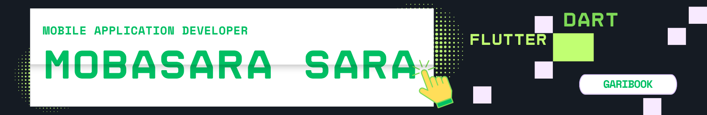

🛜 currently working on Garibook User and Garibook Driver App 👨🏼‍💻 working as a Mobile Application Developer since 2025  

## 🌐 Socials:
  

# 💻 Tech Stack:
         
# 📊 GitHub Stats:

 

  <strong style="margin-right: 40px;" >🔝 Top Contributed Repo</strong> <strong>

  
  &nbsp;&nbsp;&nbsp;&nbsp;
  

